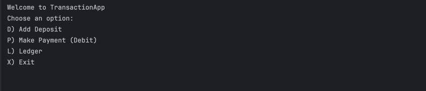

# Accounting Ledger Application

## Description of the Project
This Java console application allows users to track all financial transactions for personal or business use. The app reads from and writes to a CSV file named transactions.csv, storing each transaction on a single line in the following format:

- date|time|description|vendor|amount 
- 2023-04-15|10:13:25|Ergonomic Keyboard|Amazon|-89.50 
- 2023-04-15|11:15:00|Invoice 1001 Paid|Joe|1500.00

Users can add deposits, record payments, view a detailed ledger, and run reports or custom searches. The application is designed for anyone who wants to maintain an organized, clear view of their income and expenses without relying on spreadsheets or third-party software.

Main functionalities include:

Home screen with options to add deposits, record payments, view ledger, or exit.

Ledger screen displaying all transactions, deposits only, or payments only.

Reports menu with predefined date ranges (Month-to-Date, Previous Month, Year-to-Date, Previous Year) and vendor search.

Custom search filtering by start/end date, description, vendor, and amount.

## User Stories

- As a user, I want to input my deposits and payments, so that the application records my transactions accurately.

- As a user, I want immediate feedback if I enter invalid data, so that I can correct mistakes before saving.

- As a user, I want to view all my transactions in a ledger format, so that I can understand my financial history.

- As a user, I want to filter transactions by date, vendor, or amount, so that I can quickly find specific entries.

- As a user, I want to run pre-defined reports, so that I can analyze my finances over different time periods.

- As a user, I want to perform custom searches, so that I can find transactions matching multiple criteria.

## Setup

Instructions on how to set up and run the project using IntelliJ IDEA.

### Prerequisites

- IntelliJ IDEA: Ensure you have IntelliJ IDEA installed, which you can download from [here](https://www.jetbrains.com/idea/download/).
- Java SDK: Make sure Java SDK is installed and configured in IntelliJ.

### Running the Application in IntelliJ

Follow these steps to get your application running within IntelliJ IDEA:

1. Open IntelliJ IDEA.
2. Select "Open" and navigate to the directory where you cloned or downloaded the project.
3. After the project opens, wait for IntelliJ to index the files and set up the project.
4. Find the main class with the `public static void main(String[] args)` method.
5. Right-click on the file and select 'Run 'YourMainClassName.main()'' to start the application.

## Technologies Used

- Java 17: Programming language used for core application logic.
- IntelliJ IDEA: IDE used for development, debugging, and running the application.
- CSV File Storage: Used transactions.csv to persist all transactions.

## Demo

Include screenshots or GIFs that show your application in action. Use tools like [Giphy Capture](https://giphy.com/apps/giphycapture) to record a GIF of your application.

## Future Work

Outline potential future enhancements or functionalities you might consider adding:

- Edit or delete transactions after they are recorded.

- Add CSV backup and restore functionality.

- Include summary reports with totals, averages, or trends.

- Add a graphical user interface (GUI) for a more user-friendly experience.

## Resources

List resources such as tutorials, articles, or documentation that helped you during the project.

- [Java Programming Tutorial](https://www.example.com)
- [Effective Java](https://www.example.com)
- Pluralsight Java Fundamentals Course Materials

## Team Members

Wasid Chowdhury 

## Thanks

- Thank you to Raymond, potato sensei for continuous support and guidance.
